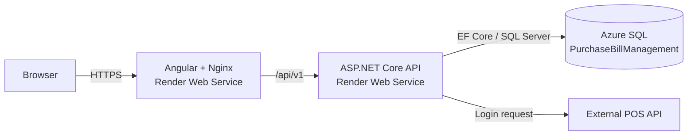

# Purchase Bill Management

Purchase Bill Management is a full-stack application for authenticating users through an external POS API, synchronizing locations, and creating purchase bills.

[](https://dotnet.microsoft.com/)
[](https://angular.dev/)
[](https://www.microsoft.com/sql-server)
[](https://www.docker.com/)

## Features

- Authenticate users through the external POS API.
- Synchronize user locations into SQL Server.
- Create purchase bills with multiple items.
- Validate bill locations and calculate totals on the API.
- Run the full stack locally with Docker Compose.
- Deploy containerized API and frontend services to Render with Azure SQL Database.

## Architecture



### Request flow

1. The browser sends login and application requests to the Angular frontend.
2. The frontend calls the ASP.NET Core API under `/api/v1`.
3. The API authenticates against the external POS API.
4. The API stores and reads locations and purchase bills from SQL Server.
5. JWT settings protect authenticated API endpoints.

### Main components

| Component     | Location                               | Responsibility                                                           |
| ------------- | -------------------------------------- | ------------------------------------------------------------------------ |
| API           | `backend/PurchaseBillManagement.Api`   | Authentication, business rules, JWT, REST endpoints, EF Core data access |
| Frontend      | `frontend/purchase-bill-management-ui` | Angular user interface and Nginx static hosting                          |
| Database      | `database`                             | SQL Server image and schema initialization script                        |
| Orchestration | `docker-compose.yml`                   | Local database, initialization, API, and frontend services               |

## Technology Stack

| Layer         | Technology                                       |
| ------------- | ------------------------------------------------ |
| Backend       | ASP.NET Core Web API on .NET 8                   |
| Frontend      | Angular 22, TypeScript                           |
| Data access   | Entity Framework Core 8 with SQL Server provider |
| Database      | Microsoft SQL Server or Azure SQL Database       |
| Web server    | Nginx                                            |
| Local runtime | Docker Compose                                   |
| Hosting       | Render Web Services and Azure SQL Database       |

## Repository Structure

```text
backend/PurchaseBillManagement.Api/
  Controllers/       API endpoints
  Data/              EF Core DbContext
  DTOs/              Request, response, and external API contracts
  Middleware/        Exception handling and traceable API errors
  Migrations/        EF Core schema migration and snapshot
  Models/            Database entities
  Services/          Authentication, locations, bills, and POS client
  Dockerfile         Multi-stage .NET 8 image

frontend/purchase-bill-management-ui/
  src/app/           Angular application
  public/             Static assets
  Dockerfile          Angular build plus Nginx runtime image
  nginx.conf          SPA hosting and API proxy configuration
  docker-entrypoint.sh Runtime API URL substitution for Nginx

database/
  Dockerfile          SQL Server image definition
  purchase_bill_management.sql  Current database initialization script

docker-compose.yml    Local multi-container environment
.env.example          Environment variable template
Screen recording.mkv   Project walkthrough
```

## Prerequisites

For the recommended Docker setup:

- Docker Desktop with Docker Compose
- An external POS API account and access to its endpoint

For development outside Docker:

- .NET SDK 8
- Node.js and npm
- SQL Server, local or hosted

## Quick Start: Docker Compose

### 1. Create environment file

```powershell
Copy-Item .env.example .env
```

Edit `.env` and replace the placeholders:

```dotenv
MSSQL_SA_PASSWORD=replace-with-a-strong-password
JWT_KEY=replace-with-a-long-random-signing-key
JWT_ISSUER=PurchaseBillManagement.Api
JWT_AUDIENCE=PurchaseBillManagement.UI
JWT_EXPIRY_MINUTES=120
ASPNETCORE_ENVIRONMENT=Production
EXTERNAL_API_BASE_URL=https://ez-staging-api.azurewebsites.net
FRONTEND_URL=http://localhost:4200
API_URL=http://api:8080
```

Do not commit `.env` or real credentials.

### 2. Start the stack

```powershell
docker compose up --build
```

The `database-init` service creates the `PurchaseBillManagement` database and applies the current SQL script when the migration is not already present. Database files persist in the `purchase_bill_sql_data` named volume.

### 3. Open local services

| Service    | Address               |
| ---------- | --------------------- |
| Frontend   | http://localhost:4200 |
| API        | http://localhost:5104 |
| SQL Server | `localhost,1433`      |

### 4. Stop the stack

```powershell
docker compose down
```

To remove the local database and all persisted data:

```powershell
docker compose down -v
```

## Local Development Without Compose

### API

```powershell
dotnet restore backend/PurchaseBillManagement.Api/PurchaseBillManagement.Api.csproj
dotnet run --project backend/PurchaseBillManagement.Api/PurchaseBillManagement.Api.csproj
```

The API normally listens on `http://localhost:5104`.

### Frontend

```powershell
Set-Location frontend/purchase-bill-management-ui
npm ci
npm start
```

The Angular development server listens on `http://localhost:4200` and uses `proxy.conf.json` for local `/api` requests.

## Configuration

### API variables

ASP.NET Core maps double underscores to nested configuration sections.

| Variable                               | Purpose                                |
| -------------------------------------- | -------------------------------------- |
| `ConnectionStrings__DefaultConnection` | SQL Server connection string           |
| `Jwt__Key`                             | JWT signing key                        |
| `Jwt__Issuer`                          | JWT issuer                             |
| `Jwt__Audience`                        | JWT audience                           |
| `Jwt__ExpiryMinutes`                   | Token lifetime in minutes              |
| `ExternalApi__BaseUrl`                 | External POS API base URL              |
| `Frontend__Url`                        | Hosted frontend origin allowed by CORS |
| `ASPNETCORE_ENVIRONMENT`               | ASP.NET Core environment               |
| `ASPNETCORE_HTTP_PORTS`                | API container port, normally `8080`    |

### Frontend variables

| Variable  | Purpose                                                                             |
| --------- | ----------------------------------------------------------------------------------- |
| `API_URL` | Nginx upstream URL. Compose uses `http://api:8080`; Render uses the public API URL. |

The Angular source currently contains `API_BASE_URL` in `frontend/purchase-bill-management-ui/src/app/core/config/api.config.ts`. Update it to the real deployed API URL before building the production frontend image, or change it to an empty string when using only the Nginx same-origin `/api` proxy.

## Database

The current schema is defined in `database/purchase_bill_management.sql` and corresponds to EF migration `20260918131407_InitialMigration`.

Tables:

- `Location_Details`
- `Purchase_Bills`
- `Purchase_Bill_Items`
- `__EFMigrationsHistory`

The database name used by the application is:

```text
PurchaseBillManagement
```

### Azure SQL for Render

For a Render free Web Service, use a managed Azure SQL Database with:

- Public network access enabled
- Proxy connection policy
- Firewall rules allowing the API service to connect

Run `database/purchase_bill_management.sql` in Azure Query Editor against the `PurchaseBillManagement` database, then configure the API with:

```text
ConnectionStrings__DefaultConnection=Server=tcp:YOUR_SERVER.database.windows.net,1433;Initial Catalog=PurchaseBillManagement;User ID=YOUR_USER;Password=YOUR_PASSWORD;Encrypt=True;TrustServerCertificate=False;Connection Timeout=30;
```

Verify the schema:

```sql
SELECT name
FROM sys.tables
WHERE name IN ('Location_Details', 'Purchase_Bills', 'Purchase_Bill_Items');

SELECT * FROM __EFMigrationsHistory;
```

Do not run SQL Server as a normal free Render Web Service. It is not an HTTP service and does not provide suitable persistent storage for this use case.

## API Endpoints

| Method | Endpoint                | Auth         |
| ------ | ----------------------- | ------------ |
| `POST` | `/api/v1/auth/login`    | Public       |
| `GET`  | `/api/v1/locations`     | Bearer token |
| `GET`  | `/api/v1/purchasebills` | Bearer token |
| `POST` | `/api/v1/purchasebills` | Bearer token |

API failures return a `traceId` and the same value in the `X-Trace-Id` response header. Use it to find the full exception in Render logs without exposing credentials to the client.

## Docker Images

Build locally:

```powershell
docker build -f backend/PurchaseBillManagement.Api/Dockerfile `
  -t purchase-bill-management-backend:local `
  backend/PurchaseBillManagement.Api

docker build -f frontend/purchase-bill-management-ui/Dockerfile `
  -t purchase-bill-management-frontend:local `
  frontend/purchase-bill-management-ui
```

The API image listens on port `8080`; the frontend image listens on port `80`.

## Render Deployment

The GitHub Actions workflow publishes these Docker Hub images when the relevant folders change on `main`:

```text
YOUR_DOCKERHUB_USERNAME/purchase-bill-management-backend:latest
YOUR_DOCKERHUB_USERNAME/purchase-bill-management-frontend:latest
YOUR_DOCKERHUB_USERNAME/purchase-bill-management-database:latest
```

Configure these GitHub repository secrets:

```text
DOCKERHUB_USERNAME
DOCKERHUB_TOKEN
```

### Deploy the API service

Create a Render Web Service from the backend image:

```text
Image: YOUR_DOCKERHUB_USERNAME/purchase-bill-management-backend:latest
Port: 8080
```

Set:

```text
ASPNETCORE_ENVIRONMENT=Production
ASPNETCORE_HTTP_PORTS=8080
ConnectionStrings__DefaultConnection=YOUR_AZURE_SQL_CONNECTION_STRING
Jwt__Key=YOUR_NEW_LONG_RANDOM_SECRET
Jwt__Issuer=PurchaseBillManagement.Api
Jwt__Audience=PurchaseBillManagement.UI
Jwt__ExpiryMinutes=120
ExternalApi__BaseUrl=https://ez-staging-api.azurewebsites.net
Frontend__Url=https://YOUR_FRONTEND_SERVICE.onrender.com
```

Copy the API's public URL after deployment.

### Deploy the frontend service

Create a second Render Web Service from the frontend image:

```text
Image: YOUR_DOCKERHUB_USERNAME/purchase-bill-management-frontend:latest
Port: 80
API_URL=https://YOUR_BACKEND_SERVICE.onrender.com
```

Redeploy after changing `API_URL` so the entrypoint can generate the Nginx configuration. Also verify the compiled `API_BASE_URL` described in the configuration section.

Set the API CORS origin to the exact frontend origin:

```text
Frontend__Url=https://YOUR_FRONTEND_SERVICE.onrender.com
```

Do not add `/api`, a path, or a trailing slash.

## Troubleshooting

### Login works but locations return `503`

Login uses the external POS API, while locations use Azure SQL. Check:

1. Render API logs using the response `traceId`.
2. `ConnectionStrings__DefaultConnection` spelling and value.
3. Azure SQL public access and firewall rules.
4. Database name `PurchaseBillManagement`.
5. The schema and `20260918131407_InitialMigration` entry.
6. The API uses the Azure hostname and port `1433`, not `localhost`.

### Frontend returns `502`

1. `API_URL` points to the backend Render URL, not the frontend URL.
2. The API listens on Render port `8080`.
3. The frontend was redeployed after changing `API_URL`.
4. `API_BASE_URL` is not an old backend hostname.

### API returns `401`

Ensure the token was created with the current values of `Jwt__Key`, `Jwt__Issuer`, and `Jwt__Audience`. Log in again after changing any JWT setting.

## Video

[[](https://youtu.be/v6XOkbO_4QU)](https://github.com/user-attachments/assets/edc7a097-a6d5-445f-8d0a-702ac8083615)

The original recording is also available as [Screen recording.mkv](Screen%20recording.mkv).

## Security

- Never commit `.env` files or production credentials.
- Rotate credentials exposed during development or troubleshooting.
- Use a strong random JWT key and SQL password.
- Restrict Azure SQL firewall access as much as your hosting provider permits.
- Do not expose SQL Server port `1433` publicly in production.

## License

No license has been specified for this repository.
